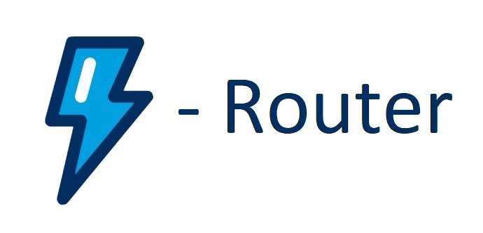

# lwc-router
 Simple Router For Standalone LWC Single Page Application that works with communities, standalone lightning/aura applications.
 
 

Maps a URL to lightning component that essentially represents a page/module in SPA.

For this specifically, salesforce does not provide any routing even for LWC in lightning experience (similar to navigate to component for aura components) let alone in a standalone application.

Keeping this in mind, here's lwc-router, which registers your components as LWC accessible components and even works when you bookmark them!!

# Installation:
Get all the LWC and apex classes deployed in your org and you're all set!

Alternatively, copy all contents under force-app/main/default/ to try the provided example.

# Get Started:

At the core of lwc-router is routerModule, here's all the exports that might help you with implementation.

    routeMeTo (function)               - updates app URL and updates UI
    getURLParams (function)            - returns map of all current page params 
    fetchCurrentPageState (function)   - returns current page state
    getPageName (function)             - returns current page

### To register a component as page:

c-router-module has two duties, as a root it behaves as container for all your page level components and as a registrar it can register them as a page, 

root requires no attributes
registrar component 
    - will require "register-page" attribute which represent a pagename and maps passed component     with that pagename in url.
    -set "is-default" attribute as true on registrar when registering home component 

```
 <c-router-module>           <!--root c-router-module component , should be created only once-->
        <!--
            registrar c-router-module components
            should register all pages at once
        -->
        <c-router-module register-page="home" is-default="true">
            <c-router-test-home></c-router-test-home>                  <!-- component that represents a page 
            "register-page" - is the page name that will be registered for this component and will be present in URL as queryparam "page=home"
            -->
        </c-router-module>
        <c-router-module register-page="contacts">
            <c-router-test-contacts></c-router-test-contacts>           <!-- component that represents a page -->
        </c-router-module>
    </c-router-module>
```

### To route to a page:

arg0: pageName (String) - is mandatory and should be a registered pagename
arg1: state (Object)    - to set a state to new page 
arg2: params (Object)    - to add additional params
```
routeMeTo('contacts', {}, { listview : 1 });
        //resultant url: "/SimpleRouterApp.app?page=contacts&listview=1"
```


### Well, that's it!! simple, happy routing!
